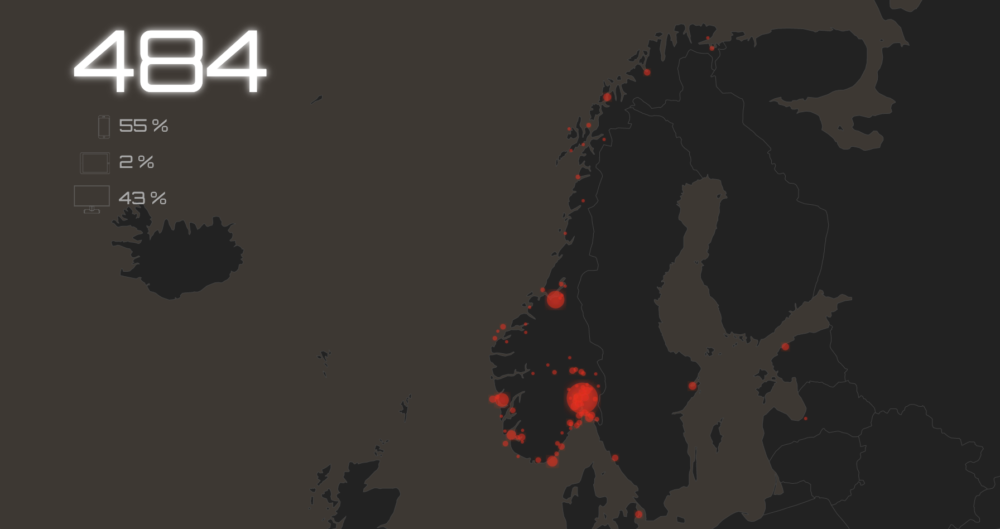

# api3

Rewritten in Go as part of a consolidation effort to scale back infrastructure.

Retries realtime statistics from Google Analytics and visualize it on a map.

[https://tovare.com/dashboard/](https://tovare.com/dashboard/)

# Deploying the application

Running fine under the least expensive F1 instance which is the default, this application can
be deployed using.

    gcloud app deploy

To see the command later use:

    cloud app browse

A prerequisite for this application is a cloud scheduler.